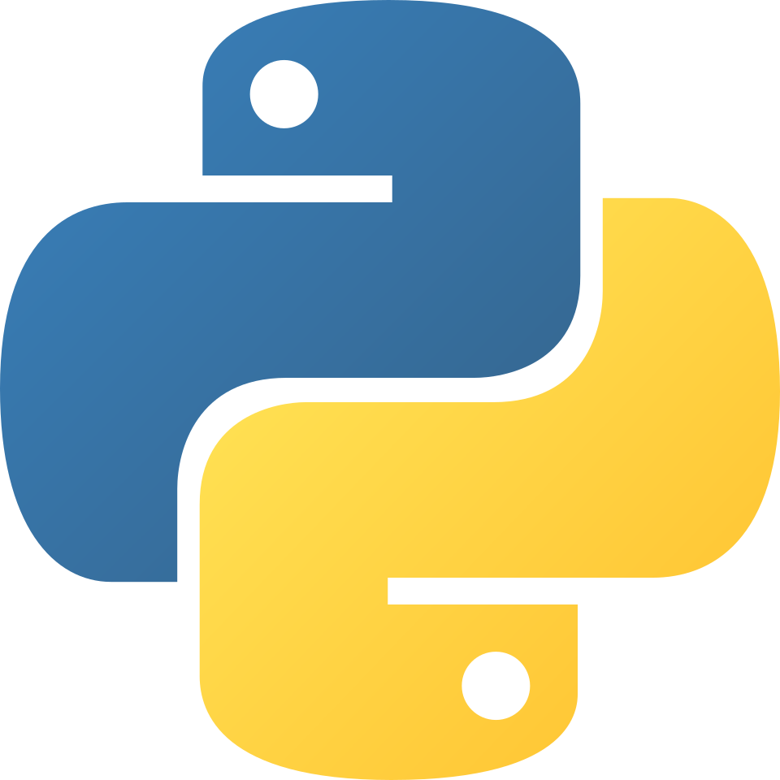

<div align="center">
 
<br> 
 

    
<h1>Ron 2026 - <b>experiments/robotpy</b></h1>
<p>FRC Team StuyPlus <b>516</b> - First regular season Rookie Robot</p>
</div>
<div align="center">

[](https://github.com/StuyPulse/StuyPlus-2026/tree/experiments/robotpy)
[](LICENSE)

</div>

---

## experiments/robotpy
This branch is an experiment regarding rewriting our main codebase in Python. This is not intended to be a replacement of our Java robot code, but rather for the purposes of learning.

## Setup
Download [Python](https://www.python.org/downloads/) first obviously.
1. Clean your workspace if switching branches. There may be artifacts from the previous branch.
> [!WARNING]
> This will remove any untracked files so make sure you have nothing that you want to keep.
```
git clean -fd
```
2. Make a python environment
```
python -m venv .venv
```
3. Activate the environment
```
.\.venv\scripts\activate
```
4. Install packages from requirements.txt
```
pip install -r requirements.txt
```
5. Sync robotpy components
```
cd src
robotpy sync
```
