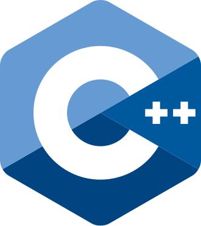
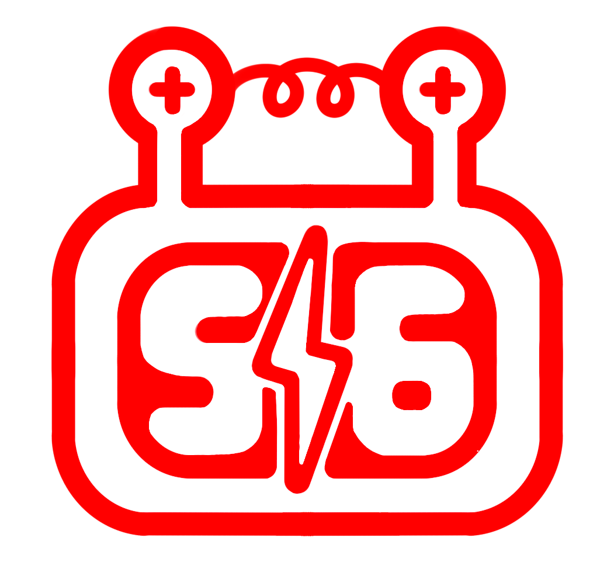

 
  
 

    
<h1>Ron 2026 - <b>experiments/cpp</b></h1>

FRC Team StuyPlus <b>516</b> - First regular season Rookie Robot

---

## experiments/cpp
This branch is an experiment regarding rewriting our main codebase in C++. This is not intended to be a replacement of our Java robot code, but rather for the purposes of learning.
